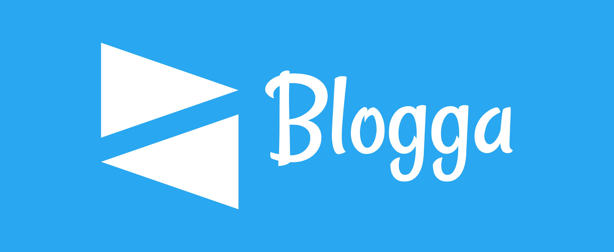
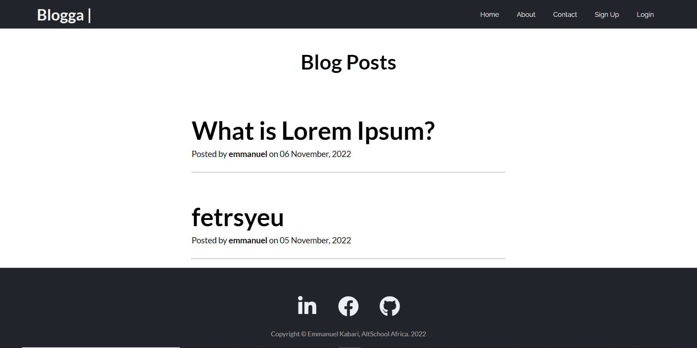

# Blogga

<a name="readme-top"></a>


<!-- PROJECT SHIELDS -->
<div align="center">

  [![Contributors][contributors-shield]][contributors-url]
  [![Forks][forks-shield]][forks-url]
  [![Stargazers][stars-shield]][stars-url]
  [![Issues][issues-shield]][issues-url]
  [![MIT License][license-shield]][license-url]
  [![LinkedIn][linkedin-shield]][linkedin-url]

</div>

<!-- PROJECT LOGO -->

<br />

<div align="center">

<a href="https://github.com/Kabari/Blogga
">



</a>

<p align="center">

<a href="https://github.com/Kabari/Blogga
"><strong>Explore the docs »</strong></a>

<a href="https://github.com/Kabari/Blogga
">View Demo</a>
·
<a href="https://github.com/Kabari/Blogga/issues">Report Bug</a>
·
<a href="https://github.com/Kabari/Blogga/issues">Request Feature</a>

</p>

</div>

<!-- TABLE OF CONTENTS -->

<details>

<summary>Table of Contents</summary>

<ol>

<li>

<a href="#about-blogga">About Blogga/a>

<ul>

<li><a href="#built-with">Built With</a></li>

</ul>

</li>

<li>

<a href="#getting-started">Getting Started</a>

<ul>

<li><a href="#prerequisites">Prerequisites</a></li>

<li><a href="#installation">Installation</a></li>

</ul>

</li>

<li><a href="#usage">Usage</a></li>

<li><a href="#contributing">Contributing</a></li>

<li><a href="#license">License</a></li>

<li><a href="#contact">Contact</a></li>

<li><a href="#acknowledgments">Acknowledgments</a></li>

</ol>

</details>

<!-- ABOUT THE PROJECT -->

##  About Blogga



Blogga is the world class blogging app for everyone, to post articles, thoughts and ideas.

It was an exam projec built using Python and the Flask Web Framework by <a href="https://github.com/Kabari">Emmanuel Kabari</a>, a Backend Engineering student at <a href="https://altschoolafrica.com/schools/engineering">AltSchool Africa</a> to demonstrate:

Flask Core Routing

Flask Authentication

Flask Basic CRUD operation


<p align="right">(<a href="#readme-top">back to top</a>)</p>

### Built With:

![Python][python]
![Flask][flask]
![Jinja][jinja]
![HTML5][html5]
![CSS3][css3]
![SQLite][sqlite]

<p align="right"><a href="#readme-top">back to top</a></p>

## Usage

To get a local copy up and running, follow the steps below.

### Prerequisites

Python3: [Get Python](https://www.python.org/downloads/)

### Installation

1. Clone this repo
   ```sh
   git clone https://github.com/Kabari/Blogga.git
   ```
2. Enter into the cloned folder
   ```sh
   cd Blogga
   ```
3. Activate the virtual environment
   ```sh
   venv/Scripts/activate
   ```
4. Install project packages
   ```sh
   pip install -r requirements.txt
   ```
5. Run Flask
   ```sh
   flask run
   ```
6. Open the link generated in the terminal on a browser

<p align="right"><a href="#readme-top">back to top</a></p>


<!-- CONTRIBUTING -->

##  Contributing

Contributions are what make the open source community such an amazing place to learn, inspire, and create. Any contributions you make are **greatly appreciated**.

If you have a suggestion that would make this better, please fork the repo and create a pull request. You can also simply open an issue with the tag "enhancement".

Don't forget to give the project a star! Thanks again!

1. Fork the Project

2. Create your Feature Branch (`git checkout -b feature/NewFeature`)

3. Commit your Changes (`git commit -m 'Add some NewFeature'`)

4. Push to the Branch (`git push origin feature/NewFeature`)

5. Open a Pull Request

<p align="right">(<a href="#readme-top">back to top</a>)</p>

<!-- LICENSE -->

##  License

Distributed under the MIT License. See <a href="https://github.com/Kabari/Blogga/blob/main/LICENSE">`LICENSE.md`</a> for more information.

<p align="right">(<a href="#readme-top">back to top</a>)</p>

<!-- CONTACT -->

##  Contact

Emmanuel Kabari - [@Kabari Emmanuel](https://www.linkedin.com/in/kabari-emmanuel/) - kabariirenaeus@gmail.com

Project Link: [Blogga](https://github.com/Kabari/Blogga)

<p align="right">(<a href="#readme-top">back to top</a>)</p>

<!-- ACKNOWLEDGMENTS -->

## Acknowledgements

This project was made possible by:

* [AltSchool Africa School of Engineering](https://altschoolafrica.com/schools/engineering)
* [Caleb Emelike's Flask Lessons](https://github.com/CalebEmelike)
* [Ze-Austin's repo](https://github.com/Ze-Austin/altschool-python)
* [GitHub Student Pack](https://education.github.com/globalcampus/student)
* [NameCheap Logo Maker](https://www.namecheap.com/logo-maker/)
* [Othneil Drew's README Template](https://github.com/othneildrew/Best-README-Template)
* [Stack Overflow](https://stackoverflow.com/)
* [Codemy Flask Friday](https://www.youtube.com/watch?v=0Qxtt4veJIc&list=PLCC34OHNcOtolz2Vd9ZSeSXWc8Bq23yEz)

<p align="right"><a href="#readme-top">back to top</a></p>

<!-- MARKDOWN LINKS & IMAGES -->

<!-- https://www.markdownguide.org/basic-syntax/#reference-style-links -->

[contributors-shield]: https://img.shields.io/github/contributors/Kabari/Blogga.svg?style=for-the-badge

[contributors-url]: https://github.com/Kabari/Blogga/graphs/contributors

[forks-shield]: https://img.shields.io/github/forks/Kabari/Blogga.svg?style=for-the-badge

[forks-url]: https://github.com/Kabari/Blogga/network/members

[stars-shield]: https://img.shields.io/github/stars/Kabari/Blogga.svg?style=for-the-badge

[stars-url]: https://github.com/Kabari/Blogga/stargazers

[issues-shield]: https://img.shields.io/github/issues/Kabari/Blogga.svg?style=for-the-badge

[issues-url]: https://github.com/Kabari/Blogga/issues

[license-shield]: https://img.shields.io/github/license/Kabari/Blogga.svg?style=for-the-badge

[license-url]: https://github.com/Kabari/Blogga/blob/main/LICENSE.txt

[linkedin-shield]: https://img.shields.io/badge/-LinkedIn-black.svg?style=for-the-badge&logo=linkedin&colorB=555

[linkedin-url]: https://www.linkedin.com/in/kabari-emmanuel/

[python]: https://img.shields.io/badge/python-3670A0?style=for-the-badge&logo=python&logoColor=ffdd54
[flask]: https://img.shields.io/badge/flask-%23000.svg?style=for-the-badge&logo=flask&logoColor=white
[jinja]: https://img.shields.io/badge/jinja-white.svg?style=for-the-badge&logo=jinja&logoColor=black
[html5]: https://img.shields.io/badge/html5-%23E34F26.svg?style=for-the-badge&logo=html5&logoColor=white
[css3]: https://img.shields.io/badge/css3-%231572B6.svg?style=for-the-badge&logo=css3&logoColor=white
[sqlite]: https://img.shields.io/badge/sqlite-%2307405e.svg?style=for-the-badge&logo=sqlite&logoColor=white
